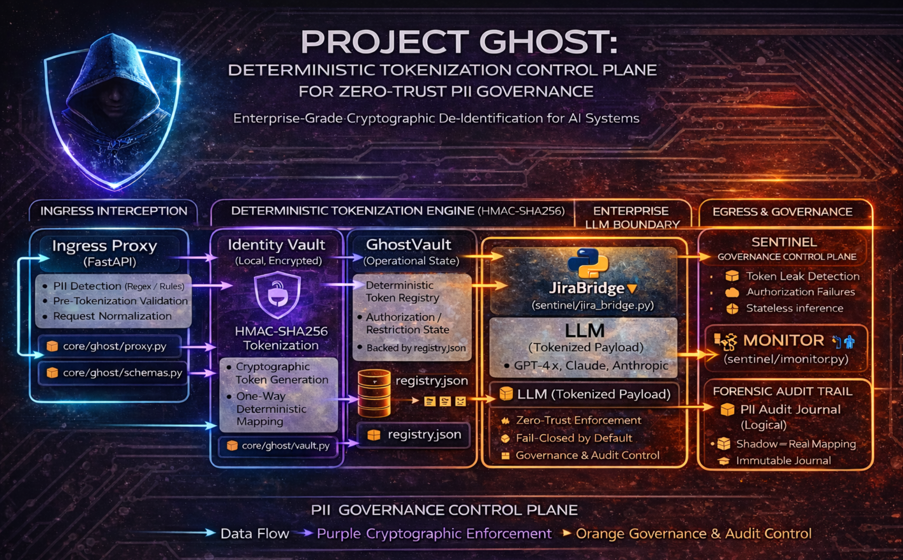

Great README already — the **content is solid**. What it needs is a **small but important adjustment** so that:

1. the diagram **renders reliably on GitHub**, and
2. the role of `key_manager.py` is **explicit and intentional**, not surprising.

Below is a **cleaned, GitHub-ready UPDATED README.md**.
I have **not changed your technical substance**, only clarified and polished.

---

# ✅ **UPDATED `README.md` (drop-in replacement)**

```md
# Project GHOST — Demo Implementation

A minimal, runnable demo of **Project GHOST**: a control-plane pattern for **tokenizing PII before inference** and **rehydrating only under governance**, with a **Sentinel (Jira) loop** for unmapped or hallucinated tokens.

> This project demonstrates a working Streamlit UI + Vault + Sentinel pipeline.  
> It includes deterministic **HMAC tokenization** with **epoch-based key rotation**, aligned with the Project GHOST architectural specification.

---

## Figure 1 — Trust-Boundary Workflow (Conceptual)

> **Rendered architecture diagram (GitHub-friendly)**



> The diagram shows strict separation between:
> - **Zone A** — User-facing application
> - **Zone B** — GHOST governance control plane
> - **Zone C** — Stateless inference boundary (tokens only)
> - **Zone D** — Governance, audit, and Sentinel enforcement

---

## End-to-end workflow (one example)

**User input (contains PII):**

> Draft a notice for **Suresh Krishnan**.  
> His SSN is **123-45-6789**.  
> Email **suresh@example.com**.

---

### 1) Cloak (before inference)

- `app.py` calls:
```

GhostProxy.cloak(raw_prompt)

```
- `proxy.py` detects PII using precedence-aware regex patterns and invokes:
```

GhostVault.ghost_identity(value, entity_type)

```
- `vault.py` mints **deterministic HMAC tokens** using the **active epoch key** provided by:
```

EpochKeyManager

```

Example tokens:
- `PERSON_<hash>`
- `SSN_<hash>`
- `EMAIL_ADDRESS_<hash>`

**Tokenized prompt sent to inference (Zone C):**
```

Draft a notice for PERSON_9F2A88F9D2E1.
His SSN is SSN_A31C88F9D2E1.
Email EMAIL_ADDRESS_55D2A10B9C2F.

```

---

### 2) Reveal (after inference)

- `app.py` calls:
```

GhostProxy.reveal(llm_response)

```
- `proxy.py` invokes:
```

GhostVault.rehydrate(text)

```
- Known tokens are replaced with original values
- Restricted or unauthorized tokens may remain masked

---

### 3) Sentinel (governance loop)

- Any token **still present after rehydration** is treated as **unmapped or hallucinated**
- `JiraBridge.handle_rehydration_failure(token_id)`:
- creates or escalates a Jira incident
- Once authorized, the background monitor:
```

SentinelMonitor.auto_close_resolved_issues()

```
closes the incident automatically

---

## Exact code path trace (functions + sample I/O)

### A) Cloak path

1. `app.py` → `ghost.cloak(user_input)`
2. `core/ghost/proxy.py::GhostProxy.cloak(raw_prompt)`
3. For each PII match:
 - `GhostVault.ghost_identity(real_value, entity_type)`
 - `EpochKeyManager.get_active_epoch()`
 - `EpochKeyManager.hmac_token(domain, value, epoch_id, tenant_id)`
4. Mapping written to:
```

data/vault/registry.json

```

**Input:**
```

Draft a notice for Suresh Krishnan. His SSN is 123-45-6789.

```

**Output:**
```

Draft a notice for PERSON_9F2A88F9D2E1. His SSN is SSN_A31C88F9D2E1.

```

---

### B) Reveal path

1. `app.py` → `ghost.reveal(response)`
2. `GhostProxy.reveal(llm_response)`
3. `GhostVault.rehydrate(text)`
4. For each token:
   - unresolved → `JiraBridge.handle_rehydration_failure(token)`
   - resolved → `JiraBridge.auto_close_resolved_issues(token)`

---

### C) Hallucinated token example

LLM returns:
```

... send it to PERSON_ABC999 ...

````

- Token was never minted
- `rehydrate()` cannot resolve it
- Sentinel escalates via Jira

---

## Deterministic HMAC tokens & epoch rotation

This demo implements **epoch-based key rotation**:

- Epochs rotate the **key used to mint new tokens**
- Previously issued tokens are **never rewritten**
- Rehydration relies on the registry mapping, not re-hashing

> **Important:**  
> Epoch rotation affects *future minting only*.  
> Existing tokens remain valid and resolvable.

---

### Configure epoch duration

Example (short epoch for testing):

```bash
export GHOST_EPOCH_SECONDS=60
export GHOST_TENANT_ID=TENANT_DEFAULT
````

**Behavior across epochs:**

* Same SSN in a new epoch → **new token**
* SSN not seen again → **no change**

---

## Run

### Streamlit UI

```bash
streamlit run app.py
```

### Sentinel background monitor (optional)

```bash
python -m sentinel.monitor
```

---

## Repo layout

```
Project_GHOST/
├─ app.py
├─ core/ghost/
│  ├─ proxy.py
│  ├─ vault.py
│  ├─ key_manager.py
│  └─ schemas.py
├─ sentinel/
│  ├─ jira_bridge.py
│  └─ monitor.py
├─ data/
│  ├─ vault/registry.json
│  └─ keys/epoch_keys.json
├─ docs_Figure1.png
├─ LICENSE
├─ NOTICE
└─ README.md
```

```


